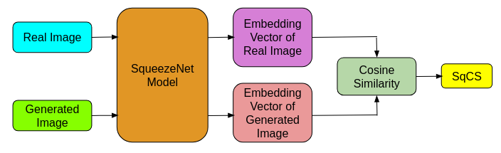

# Leapfrog Solver and SqueezeNet Cosine Similarity (SqCS) for Faster and Quality Sampling

## Leapfrog Solver

We developed the Leapfrog Solver for faster sampling of diffusion models, achieving high-quality results in approximately 4 inference steps.


The Leapfrog Solver functions as depicted below:


### Features

- **Efficient Sampling**: Accelerates sampling
- **Versatile Application**: Generates high-quality samples for both class-conditional and unconditional (without class) images.

### Usage

To generate ImageNet samples (conditional images), run:

```shell script
python imagenet_sampling.py
```

To generate unconditional images for datasets like CelebAHQ, FFHQ, LSUN Churches, and LSUN Bedrooms, use:

```shell script
python sample_diffusion.py -r <path for model.ckpt> -l <output directory for sampled images> -n <number of samples to be generated> --batch_size <batch size> -c <number of inference steps> -e <eta>
```

Example to generate samples of CelebAHQ dataset:
```shell script
python sample_diffusion.py -r models/ldm/celeba256/model.ckpt -l output_samples/4steps -n 50000 --batch_size 100 -c 4 -e 0
```
We utilize the prede-trained models weights of LDMs (Latent diffusion models) from  [https://github.com/CompVis/latent-diffusion](https://github.com/CompVis/latent-diffusion).

## SqueezeNet Cosine Similarity (SqCS)

We develop SqCS to assess the quality of generated images across several inference steps and to determine the best inference step. It address the several drawbacks of existing popular metrics like FID,SSIM, and PSNR.

We compute SqCS metric as shown in this flowchart.


### Usage

To compute SqCS metric between real and generated images, run:

```shell script
python sqcs.py <directory of real images> <directory of generated images> --batch_size <batch size>
```

Example:
```shell script
python sqcs.py data/real_images/lsun_churches output_samples/lsun_churches --batch_size 500
```


